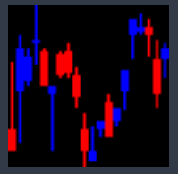

# candlechart4ML
Candle chart generator optimized for machine learning

## Description

Provide functions for generating candlechart images.

It is optimized for Machine Learning projects. 

---
## Environment

This project is investigated on 'Windows'

---

## Usage

Please copy and paste directory named 'candlechart4ML'

And type below code line for import function.

    from candlechart4ML import candlechart_generator

There are parameters.

 data_csv_path : the path of csv file

 seq_len : the length of targrt sequence you labeled

 tre_len : the length of trend sequence you labeled

 dimension : number of pixels on sides of each candlechart image. Three times the sequence length is recommended(for square shaped image)

 use_volume : not implemented yet, please set to 'False'

    candlechart_dir = candlechart_generator(data_csv_path, seq_len=20, tre_len=20, dimension=60, use_volume=False)

